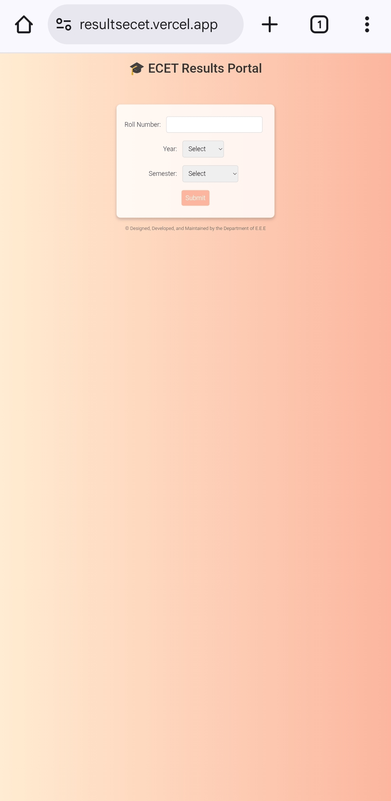

# 🎓 ECET Results Portal

This project is a *Semester Results Web Application* built using *HTML, CSS, and JavaScript*.  
The backend is handled using *JSON files hosted on Vercel*, which makes it fast, simple, and serverless.

---

## 📌 Features:
- 🔎 Search results by *Roll Number* 
- 📅 Filter by *Year & Semester*
- 🅰  Auto capital *Roll Number*
- 🎨 Clean UI with *gradient background*
- 🔓 Right-click disabled for *extra safety*
- 📊 Results displayed in a *dynamic table* with Subject Code, Name, Internals, Grade, and Credits
- ⚡ Backend JSON served via *Vercel*

---

## 🛠 Tech Stack:
- **Frontend:** HTML, CSS, JavaScript  
- **Backend / Hosting:** JSON files hosted on Vercel  

---

## 🚀 How It Works:
1. User enters their *Roll Number, selects **Year* and *Semester*.
2. JavaScript dynamically fetches the corresponding JSON file:

## 🌐 Live Demo
👉 [ECET Portal source code](https://github.com/kirananisetti/ECET-PORTAL/blob/main/index.html)  
👉 [Live webpage](https://resultsecet.vercel.app/)

---

## 📷 Screenshot

---

## 👨‍💻 Author
-© Designed, Developed, and Maintained by Department of **E.E.E**
